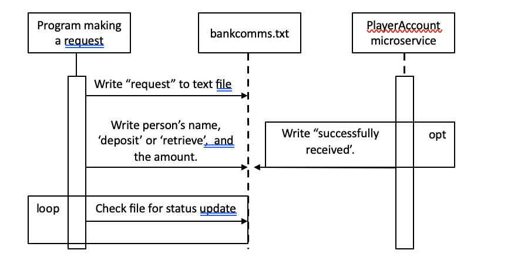

#CS361 Assignment 9 
by Sharyn Miyaji

Partner: James Hill

**How to programmatically REQUEST data:**

In the bankcomms.txt file, the first line must contain the word "request" in order to start the microservice.  After
the first line, the name of the player, the action ('deposit'/'receive'), and the amount must be written using a space to
separate the variables.  

**How to programmatically RECEIVE data:**

Once the request is completed, the bankcomms.txt file will have the phrase "Successfully received" to indicate that the
transaction is completed for the player.  

**UML Diagram:**

